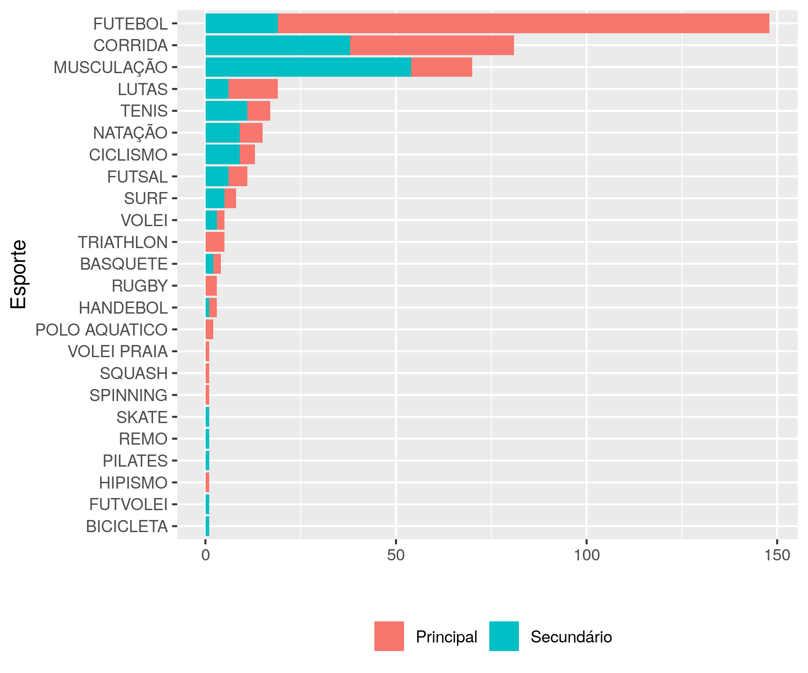
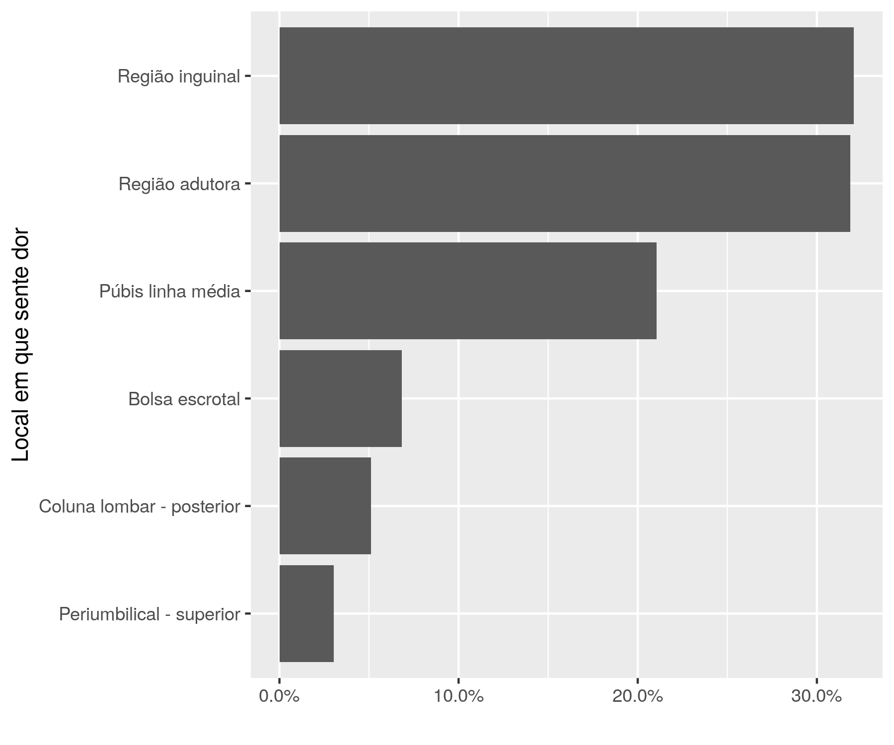

```{r setup, include=FALSE}
knitr::opts_chunk$set(echo = FALSE)
knitr::opts_knit$set(root.dir = normalizePath(".."))
options(scipen = 999)
library(pander)
library(knitr)
library(philsfmisc)
panderOptions('table.style', 'rmarkdown')

```

---

**Histórico do documento**

```{r, echo = FALSE}
Version <- c("01")
Changes <- c("Versão inicial")
history <- cbind(Version, Changes)
colnames(history) <- c("Versão", "Alterações")
pander(history, split.cells = 70)
# kable(history)
```

---

<!-- # Assinaturas -->

<!-- ```{r, echo=FALSE} -->
<!-- sig.field <- "__________________________" -->
<!-- date.field <- "_____________" -->
<!-- Stat <- c("Elaborador", "Felipe Figueiredo", "Bioestatístico", sig.field, date.field) -->
<!-- Reviewer <- c("Revisado por", "", "", sig.field, date.field) -->
<!-- Approver <- c("Verificado por", "", "", sig.field, date.field) -->
<!-- Final.Approver <- c("Aprovação final", "", "", sig.field, date.field) -->

<!-- sigs <- rbind( -->
<!--   Stat -->
<!--   , Reviewer -->
<!--   , Approver -->
<!--   , Final.Approver -->
<!--   ) -->
<!-- rownames(sigs) <- NULL -->
<!-- colnames(sigs) <- c("Papel", "Nome", "Função", "Assinatura", "Data") -->

<!-- pander(sigs, split.cells = c(9, 14, 14, 16, 8), split.table = Inf) -->
<!-- # kable(sigs) -->
<!-- ``` -->

# Lista de abreviaturas

# Introdução

## Objetivos

Descrever as ocorrências de pubalgia em atletas de diversas modalidades esportivas e níveis de dedicação.

## Recepção e tratamento dos dados

Os dados foram recebidos em uma planilha Excel, no formato longo (uma observação por linha).
A planilha continha tabelas separadas para classificar corretamente os dados em que um participante contribui com várias observações.
As tabelas utilizadas nesta análise representam:

- Dados dos participantes
- Esportes praticados
- Locais em que os participantes sentem dor
- Movimentos em que os participantes sentem dor

Todas as tabelas contém um código unívoco que identifica cada participante.
Este código foi usado para mergir as tabelas para análise.

# Metodologia

```{r include=FALSE}
source("scripts/resultados.R", encoding = 'UTF-8')
source("scripts/visualizacoes.R", encoding = 'UTF-8')
```

Foi feita uma análise exploratória de dados, descrevendo o perfil epidemiológico dos participantes do estudo.
As variáveis categóricas são apresentadas como frequência e proporção (%).

Esta análise foi realizada utilizando-se o software `R` versão `r getRversion()`.

# Resultados

## Participantes do estudo

```{r}
N.amostra <- length(levels(participantes$ID))
N.sexo <- table(participantes$SEXO)
N.nivel <- table(participantes$NIVEL)
paises.ext <- c("Angola", "Guiné", "França", "Portugal")
UF <- levels(droplevels(participantes[!(UF %in% paises.ext), UF]))
```

Esta série de casos contou com `r N.amostra` participantes, dos quais `r N.sexo["F"]` era mulheres e `r N.sexo["M"]` eram homens.
Os participantes do estudo tinham idades entre `r min(participantes$IDADE)` e `r max(participantes$IDADE)` anos.
Atletas atuantes no Brasil, os participantes são oriundos de `r length(UF)` estados brasileiros (`r UF`), e `r length(paises.ext)` atletas estrangeiros (`r paises.ext`).

Os participantes foram perguntados sobre o nível de dedicação que eles praticam seu esporte: `r N.nivel["PROFISSIONAL"]` praticam no nível profissional, `r N.nivel["UNIVERSITÁRIO/ESCOLAR"]` no nível universitário/escolar e `r N.nivel["RECREACIONAL"]` praticam de forma recreacional.
`r table(participantes$AGUDA)["1"]` participantes relataram sentir dor aguda.
Após as avaliações médicas `r table(participantes$CIRURGIA)["1"]` participantes receberam indicação de algum procedimento cirúrgico para mitigar os sintomas.

## Distribuição das modalidades esportivas praticadas pelos atletas com pubalgia

```{r atividades esportivas}
N.esportes.fig1 <- sort(table(esportes$ESPORTE), decreasing = TRUE)
N.princ.fig1 <- sort(table(esportes$PRINCIPAL, esportes$ESPORTE)[1, ], decreasing = TRUE)
N.sec.fig1 <- sort(table(esportes$PRINCIPAL, esportes$ESPORTE)[2, ], decreasing = TRUE)
```

Nesta série de casos, os atletas com pubalgia relataram praticar 25 modalidades esportivas distintas (**figura 1**).
Três esportes se destacam como os mais comuns entre os participantes, seja como atividade esportiva principal ou secundária.
Quando incluímos todos os atletas que praticam as modalidades esportivas sem considerar a atividade principal ou secundária temos
o futebol (N = `r N.esportes.fig1[1]`),
a corrida (N = `r N.esportes.fig1[2]`)
e a musculação (N = `r N.esportes.fig1[3]`).



As três modalidades globalmente mais comuns são também as selecionadas mais tipicamente tanto como esporte principal quanto como esporte secundário.
Quando consideradas apenas as modalidades principais dos atletas, o futebol foi selecionado como atividade principal por
`r N.princ.fig1[1]` atletas,
enquanto que a corrida e a musculação foram selecionadas por
`r N.princ.fig1[2]` e
`r N.princ.fig1[3]` atletas, respectivamente.
Juntas estas três modalidades esportivas representam
`r format.pct(sum(N.princ.fig1[1:3])/sum(N.princ.fig1))`
da amostra (`r sum(N.princ.fig1[1:3])` de `r sum(N.princ.fig1)`).
As três modalidades mais selecionadas pelos atletas como esportes secundários ou acessórios são
a musculação (N = `r N.sec.fig1[1]`),
a corrida (N = `r N.sec.fig1[2]`)
e o futebol (N = `r N.sec.fig1[3]`).
Juntas estas três modalidades representam
`r format.pct(sum(N.sec.fig1[1:3])/sum(N.sec.fig1))`
dos esportes secundários dos atletas com pubalgia
(`r sum(N.sec.fig1[1:3])` de `r sum(N.sec.fig1)`).

### Atividades auxiliares dos praticantes de futebol

```{r atividades secundárias futebol}
N.sec.fut <- sort(with(
  esportes[ID %in% ids.futebol & PRINCIPAL == "Secundário"], table(PRINCIPAL, ESPORTE)[2, ]
                       ), decreasing = TRUE)
```

As duas modalidades esportivas mais praticadas como atividade auxiliar pelos participantes com pubalgia atlética que praticam primariamente o futebol são a
musculação (N = `r N.sec.fut[1]`)
e a corrida (N = `r N.sec.fut[2]`).
Juntos estas duas modalidades representam
`r format.pct(sum(N.sec.fut[1:2])/sum(N.sec.fut))`
dos esportes secundários dos atletas com pubalgia (`r sum(N.sec.fut[1:2])` de `r sum(N.sec.fut)`).


### Atividades auxiliares dos praticantes de corrida

```{r atividades secundárias corrida}
N.sec.corr <- sort(with(
  esportes[ID %in% ids.corrida & PRINCIPAL == "Secundário"], table(PRINCIPAL, ESPORTE)[2, ]
  ), decreasing = TRUE)
```

As duas modalidades esportivas mais praticadas como atividade auxiliar pelos participantes com pubalgia atlética que praticam primariamente a corrida são a
musculação (N = `r N.sec.corr[1]`)
e futebol (N = `r N.sec.corr[2]`).
Juntos estas duas modalidades representam
`r format.pct(sum(N.sec.corr[1:2])/sum(N.sec.corr))`
dos esportes secundários dos atletas com pubalgia (`r sum(N.sec.corr[1:2])` de `r sum(N.sec.corr)`).


### Atividades auxiliares dos praticantes de musculação

```{r atividades secundárias musculação}
N.sec.musc <- sort(with(
  esportes[ID %in% ids.musculacao & PRINCIPAL == "Secundário"], table(PRINCIPAL, ESPORTE)[2, ]
  ), decreasing = TRUE)
```

As duas modalidades esportivas mais praticadas como atividade auxiliar pelos participantes com pubalgia atlética que praticam primariamente o futebol são a
musculação (N = `r N.sec.musc[1]`)
e a corrida (N = `r N.sec.musc[2]`).
Juntos estas duas modalidades representam
`r format.pct(sum(N.sec.musc[1:2])/sum(N.sec.musc))`
dos esportes secundários dos atletas com pubalgia (`r sum(N.sec.musc[1:2])` de `r sum(N.sec.musc)`).


## Características de dor

```{r dor}
interfere.tab.n <- table(participantes$INTERFERE)
interfere.tab.prop <- prop.table(table(participantes$INTERFERE))

# pander(movim.tab)
movim.tab.n <- table(table(movim$ID)) # número de movimentos em que os participantes sentem dor
movim.tab.prop <- prop.table(table(table(movim$ID))) # prop de movimentos em que os participantes sentem dor

#retirar as contagens sem dor (bug de imputação de dados?)
movim.tab.n <- movim.tab.n[2:6]
movim.tab.prop <- movim.tab.prop[2:6]

local.tab.n <- table(table(locais$ID)) # número de movimentos em que os participantes sentem dor
local.tab.prop <- prop.table(table(table(locais$ID))) # prop de movimentos em que os participantes sentem dor
```

`r interfere.tab.n[2]` participantes alegaram que a dor interfere em sua prática esportiva (`r format.pct(interfere.tab.prop[2])`).
A **figura 5** mostra a proporção de participantes que sente dor em cada um dos locais avaliados neste estudo.
`r local.tab.n[1]` (`r format.pct(local.tab.prop)[1]`) participantes relataram sentir dor em um único local, enquanto `r local.tab.n[2:4]` sentem dor em dois, três e quatro locais respectivamente (o que corresponde a `r format.pct(local.tab.prop)[2:4]` do total, respectivamente).
`r local.tab.n[5]` (`r format.pct(local.tab.prop)[5]`) participantes sentem dor nos 5 locais.
A **figura 6** mostra o número de participantes que sente dor em cada movimento avaliado neste estudo.
`r movim.tab.n[1]` participantes (`r format.pct(movim.tab.prop)[1]`) sentem dor em algum dos movimentos avaliados, enquanto `r movim.tab.n[2:4]` sentem dor em dois, três e quatro movimentos respectivamente (o que corresponde a `r format.pct(movim.tab.prop)[2:4]` do total, respectivamente).
`r movim.tab.n[5]` (`r format.pct(movim.tab.prop)[5]`) participantes sentem dor nos cinco movimentos.

<!-- **DESCREVER** -->

<!-- 1. N de participantes em que a dor interfere na prática esportiva: `r interfere.tab.n[2]` -->
<!-- 1. % de participantes em que a dor interfere na prática esportiva: `r format.pct(interfere.tab.prop[2])` -->
<!-- 1. N de movimentos em que participantes sentem (1 movimento, a todos os 5 movimentos): `r movim.tab.n` -->
<!-- 1. % de movimentos em que participantes sentem (1 movimento, a todos os 5 movimentos): `r format.pct(movim.tab.prop)` -->
<!-- 1. N de locais em que participantes sentem (1 local, a todos os 5 locais): `r local.tab.n` -->
<!-- 1. % de locais em que participantes sentem (1 local, a todos os 5 locais): `r format.pct(local.tab.prop)` -->

<!-- Observações: -->

<!-- - itens 3 e 4: Em quantos movimentos cada participante avaliado sente dor? (resultado que complementa a fig 6) -->
<!-- - itens 5 e 6: Em quantos locais cada participante avaliado sente dor? (resultado que complementa a fig 5) -->




## Performance dos exames físicos

A **tabela 1** mostra os resultados dos dez exames físicos (EF) administrados nos participantes do estudo.
Cinco exames (EF1, EF6, EF8, EF9 e EF10) demonstraram ser piores que o acaso para detectar a pubalgia presente nos participantes, obtendo resultado positivo em menos de 50% dos casos.
Dois exames, por outro lado, tiveram desempenho considerado alto.
Os exames EF2, EF4 demonstraram resultado positivo em 70% ou mais dos casos.

```{r}
pander(tab.ef)
```

Table: **Tabela 1** Performance dos 10 exames físicos para detectar a pubalgia nos atletas estudados.

EF1 = Compressão ortostática do compartimento anterior;  
EF2 = Flexão simultânea do Quadril e do Abdômen contra resistência;  
EF3 = Contração dos adutores contra resistência com joelho em flexão;  
EF4 = Contração dos adutores contra resistência com joelho em extensão;  
EF5 = Palpação do anel inguinal;  
EF6 = Palpação do corpo do Púbis;  
EF7 = Palpação da inserção do Adutor no Púbis;  
EF8 = Flexibilidade dos isquiotibiais (Encurtamento posterior);  
EF9 = Arco de movimento do quadril (Limiração da RI);  
EF10 = Teste dos Oblíquos contra resistência (Manobra de Grava).

<!-- # Exceções e Desvios do teste -->

# Discussão

Esta série de casos avaliou as distribuições dos esportes praticados por atletas com pubalgia em 25 modalidades desportivas, tanto como esporte principal como atividade secundária ou acessória (**figura 1**).
Não é surpreendente que, no Brasil, o futebol seja o esporte mais praticado pelos pacientes atendidos com pubalgia.
Neste estudo, no entanto, os atletas que demonstraram preferência por este esporte são não somente mais frequentes, mas também são os que mais praticam outras atividades (**figuras 2**, **3** e **4**).
A discrepância na opção por atividades acessórias é marcante:
`r sum(N.sec.fut)` jogadores de futebol relataram praticar atividades secundárias,
enquanto que os dados de atletas de corrida e musculação são consideravelmente (`r sum(N.sec.corr)` e `r sum(N.sec.musc)`, respectivamente).

A dor foi relatada com maior frequência nas regiões inguinal e adutora e o Púbis linha média (**figura 5**).
A troca de direção, tiros e chutes foram os movimentos com maior prevalência de dor (**figura 6**).
Estes três movimentos têm em comum o uso de força explosiva, comparada à corrida longa.
Não é evidente porém a que haja relação de causa e efeito neste tipo de movimento uma vez que o salto, que compartilha esta característica, foi o movimento com menor ocorrência de dor em nossa amostra.
São necessários outros estudos independentes para confirmar as prevalências de pubalgia atlética aqui relatadas.

Avaliações clínicas podem ser ferramentas úteis no diagnóstico precoce da pubalgia.
Nossas observações indicam que dois dos exames físicos avaliados (EF2 e EF4) são propostas promissoras apresentando resultados positivos, respectivamente, 77% e 78% dos casos.
Para confirmar esta hipótese, é necessário um estudo da capacidade discriminatória destes procedimentos a fim de estimar sua sensibilidade e especificidade.
Para determinar a metodologia mais adequada de avaliar estes exames, é necessário inicialmente definir o escopo de sua aplicação, se como diagnóstico inicial (*screening*), ou diagnóstico confirmatório.

# Conclusões


# Referências

# Apêndice

