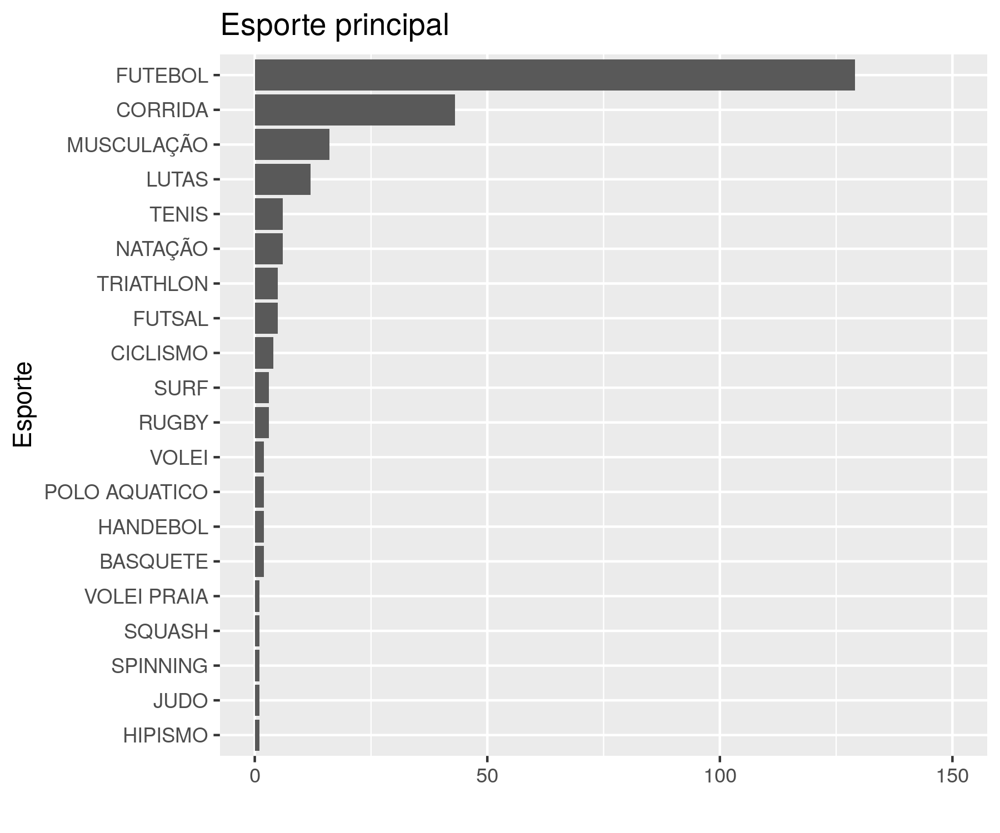
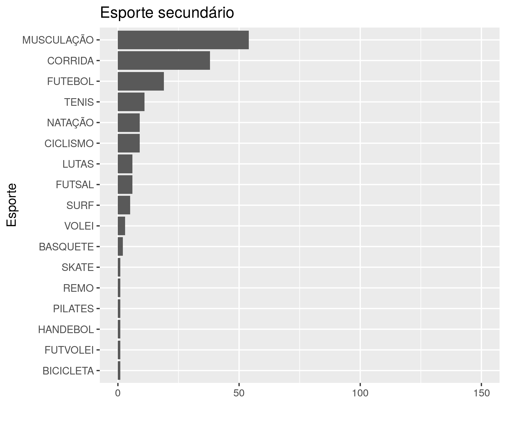

---

**Histórico do documento**

| Versão |   Alterações   |
|:------:|:--------------:|
|   01   | Versão inicial |

---

# Assinaturas

|      Papel      |       Nome        |     Função     |         Assinatura         |     Data      |
|:---------------:|:-----------------:|:--------------:|:--------------------------:|:-------------:|
|   Elaborador    | Felipe Figueiredo | Bioestatístico | __________________________ | _____________ |
|  Revisado por   |                   |                | __________________________ | _____________ |
| Verificado por  |                   |                | __________________________ | _____________ |
| Aprovação final |                   |                | __________________________ | _____________ |

# Lista de abreviaturas

# Introdução

## Objetivos

## Recepção e tratamento dos dados

# Metodologia

Esta análise foi realizada utilizando-se o software `R` versão 3.4.4.

<!-- The exact confidence intervals (CIs) of binomial proportions were calculated using package `exactci` (version 1.3.3). -->

# Resultados

## Frequência dos esportes principal e secundário na amostra

As duas modalidades esportivas mais praticadas como foco principal pelos participantes com pubalgia atlética são o futebol e a corrida
(N = 245).

As duas modalidades esportivas mais praticadas como atividade auxiliar pelos participantes com pubalgia atlética são o musculação e a corrida
(N = 168).

## Atividades auxiliares ao futebol e corrida

As duas modalidades esportivas mais praticadas como atividade auxiliar pelos participantes com pubalgia atlética que praticam primariamente o futebol são a musculação e a corrida
(N = 81).

As duas modalidades esportivas mais praticadas como atividade auxiliar pelos participantes com pubalgia atlética que praticam primariamente corrida são a musculação e a futebol
(N = 29).

<!-- # Exceções e Desvios do teste -->

# Conclusões

# Referências

# Apêndice

