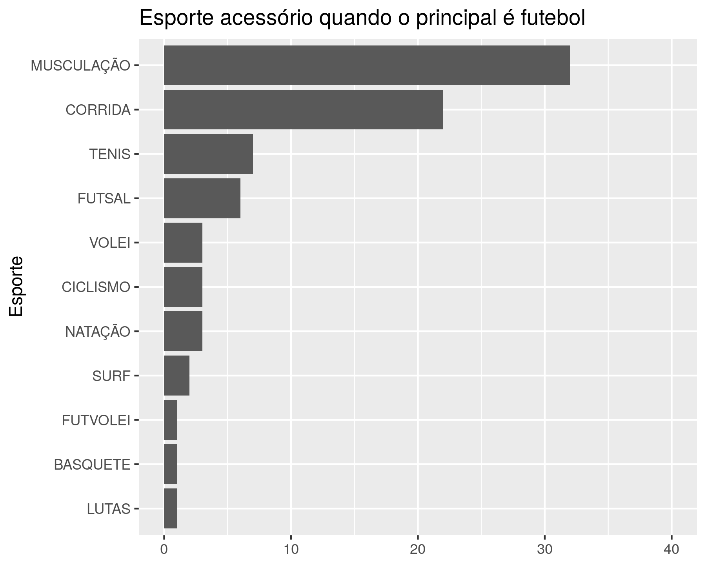

---

**Histórico do documento**


| Versão |   Alterações   |
|:------:|:--------------:|
|   01   | Versão inicial |

---

<!-- # Assinaturas -->

<!-- ```{r, echo=FALSE} -->
<!-- sig.field <- "__________________________" -->
<!-- date.field <- "_____________" -->
<!-- Stat <- c("Elaborador", "Felipe Figueiredo", "Bioestatístico", sig.field, date.field) -->
<!-- Reviewer <- c("Revisado por", "", "", sig.field, date.field) -->
<!-- Approver <- c("Verificado por", "", "", sig.field, date.field) -->
<!-- Final.Approver <- c("Aprovação final", "", "", sig.field, date.field) -->

<!-- sigs <- rbind( -->
<!--   Stat -->
<!--   , Reviewer -->
<!--   , Approver -->
<!--   , Final.Approver -->
<!--   ) -->
<!-- rownames(sigs) <- NULL -->
<!-- colnames(sigs) <- c("Papel", "Nome", "Função", "Assinatura", "Data") -->

<!-- pander(sigs, split.cells = c(9, 14, 14, 16, 8), split.table = Inf) -->
<!-- # kable(sigs) -->
<!-- ``` -->

# Lista de abreviaturas

# Introdução

## Objetivos

## Recepção e tratamento dos dados

# Metodologia


Esta análise foi realizada utilizando-se o software `R` versão 3.4.4.


# Resultados

## Distribuição das modalidades esportivas praticadas pelos atletas com pubalgia


Nesta série de casos, os atletas com pubalgia relataram praticar 25 modalidades esportivas distintas (figura 1).
Três esportes se destacam como os mais comuns entre os participantes, seja como atividade esportiva principal ou secundária.
Quando incluímos todos os atletas que praticam as modalidades esportivas sem considerar a atividade principal ou secundária temos
o futebol (N = 148),
a corrida (N = 81)
e a musculação (N = 70).


As três modalidades globalmente mais comuns são também as selecionadas mais tipicamente tanto como esporte principal quanto como esporte secundário.
Quando consideradas apenas as modalidades principais dos atletas, o futebol foi selecionado como atividade principal por
129 atletas,
enquanto que a corrida e a musculação foram selecionadas por
43 e
16 atletas, respectivamente.
Juntas estas três modalidades esportivas representam
76.7%
da amostra (188 de 245).
As três modalidades mais selecionadas pelos atletas como esportes secundários ou acessórios são
a musculação (N = 54),
a corrida (N = 38)
e o futebol (N = 19).
Juntas estas três modalidades representam
66.1%
dos esportes secundários dos atletas com pubalgia
(111 de 168).

### Atividades auxiliares dos praticantes de futebol


As duas modalidades esportivas mais praticadas como atividade auxiliar pelos participantes com pubalgia atlética que praticam primariamente o futebol são a
musculação (N = 32)
e a corrida (N = 22).
Juntos estas duas modalidades representam
66.7%
dos esportes secundários dos atletas com pubalgia (54 de 81).



### Atividades auxiliares dos praticantes de corrida


As duas modalidades esportivas mais praticadas como atividade auxiliar pelos participantes com pubalgia atlética que praticam primariamente a corrida são a
musculação (N = 9)
e futebol (N = 8).
Juntos estas duas modalidades representam
58.6%
dos esportes secundários dos atletas com pubalgia (17 de 29).


### Atividades auxiliares dos praticantes de musculação


As duas modalidades esportivas mais praticadas como atividade auxiliar pelos participantes com pubalgia atlética que praticam primariamente o futebol são a
musculação (N = 5)
e a corrida (N = 3).
Juntos estas duas modalidades representam
57.1%
dos esportes secundários dos atletas com pubalgia (8 de 14).


## Avaliação das modalides esportivas

### Associação com os exames físicos


|    &nbsp;    |  Overall   |
|:------------:|:----------:|
|    **n**     |    245     |
| **EF1 (%)**  | 77 (31.4)  |
| **EF2 (%)**  | 188 (76.7) |
| **EF3 (%)**  | 166 (67.8) |
| **EF4 (%)**  | 190 (77.6) |
| **EF5 (%)**  | 153 (62.4) |
| **EF6 (%)**  | 102 (41.6) |
| **EF7 (%)**  | 168 (68.6) |
| **EF8 (%)**  | 71 (29.0)  |
| **EF9 (%)**  | 37 (15.1)  |
| **EF10 (%)** | 120 (49.0) |

### Associação com desfecho cirúrgico e movimentos em que sente dor


|              &nbsp;              |  FUTEBOL  |  CORRIDA  | MUSCULAÇÃO |  OUTROS   |   p    | test  |
|:--------------------------------:|:---------:|:---------:|:----------:|:---------:|:------:|:-----:|
|              **n**               |    148    |    81     |     70     |    114    |        |       |
|         **CIRURGIA (%)**         |  8 (5.4)  |  4 (4.9)  | 10 (14.3)  | 19 (16.7) | 0.005  | exact |
|              **n**               |    363    |    90     |     33     |    161    |        |       |
|        **MOVIMENTO (%)**         |           |           |            |           | <0.001 |       |
|              **1**               | 88 (24.2) | 13 (14.8) |  7 (21.9)  | 42 (26.1) |        |       |
|              **2**               | 52 (14.3) | 28 (31.8) |  8 (25.0)  | 29 (18.0) |        |       |
|              **3**               | 80 (22.0) | 25 (28.4) |  7 (21.9)  | 34 (21.1) |        |       |
|              **4**               | 46 (12.7) | 10 (11.4) |  4 (12.5)  | 26 (16.1) |        |       |
|              **5**               | 97 (26.7) | 12 (13.6) |  5 (15.6)  | 29 (18.0) |        |       |
|              **6**               | 0 ( 0.0)  | 0 ( 0.0)  |  0 ( 0.0)  | 1 ( 0.6)  |        |       |
| **6 (outros - treino de força)** | 0 ( 0.0)  | 0 ( 0.0)  |  1 ( 3.1)  | 0 ( 0.0)  |        |       |

## Avaliação do tempo até o diagnóstico

### Associação com os exames físicos


|    &nbsp;    |  <= 90d   |   > 90d   |   p   | test  |
|:------------:|:---------:|:---------:|:-----:|:-----:|
|    **n**     |    118    |    127    |       |       |
| **EF1 (%)**  | 33 (28.0) | 44 (34.6) | 0.274 | exact |
| **EF2 (%)**  | 94 (79.7) | 94 (74.0) | 0.364 | exact |
| **EF3 (%)**  | 83 (70.3) | 83 (65.4) | 0.416 | exact |
| **EF4 (%)**  | 93 (78.8) | 97 (76.4) | 0.759 | exact |
| **EF5 (%)**  | 72 (61.0) | 81 (63.8) | 0.693 | exact |
| **EF6 (%)**  | 44 (37.3) | 58 (45.7) | 0.197 | exact |
| **EF7 (%)**  | 76 (64.4) | 92 (72.4) | 0.215 | exact |
| **EF8 (%)**  | 36 (30.5) | 35 (27.6) | 0.673 | exact |
| **EF9 (%)**  | 13 (11.0) | 24 (18.9) | 0.108 | exact |
| **EF10 (%)** | 59 (50.0) | 61 (48.0) | 0.799 | exact |
Table: **Tabela xx** Associação entre o tempo até o diagnóstico e os exames físicos.

<!-- # Exceções e Desvios do teste -->

# Discussão

Esta série de casos avaliou as distribuições dos esportes praticados por atletas com pubalgia em 25 modalidades desportivas, tanto como esporte principal como atividade secundária ou acessória (figura 1).
Não é surpreendente que, no Brasil, o futebol seja o esporte mais praticado pelos pacientes atendidos com pubalgia.
Neste estudo, no entanto, os atletas que demonstraram preferência por este esporte são não somente mais frequentes, mas também são os que mais praticam outras atividades (figuras 2, 3 e 4).
A discrepância na opção por atividades acessórias é marcante:
81 jogadores de futebol relataram praticar atividades secundárias,
enquanto que os dados de atletas de corrida e musculação são consideravelmente (29 e 14, respectivamente).

# Conclusões


# Referências

# Apêndice

